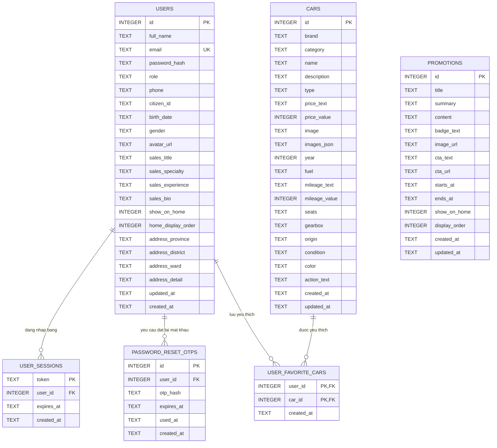

# Biểu đồ quan hệ dữ liệu

Nguồn đối chiếu: schema SQLite được khởi tạo trong `db.js`.

## Ghi chú quan hệ

- `users` là bảng tài khoản dùng chung cho khách hàng, nhân viên và admin qua cột `role`.
- `user_sessions.user_id` tham chiếu `users.id`, xóa user thì session bị xóa theo `ON DELETE CASCADE`.
- `password_reset_otps.user_id` tham chiếu `users.id`, xóa user thì OTP đặt lại mật khẩu bị xóa theo.
- `user_favorite_cars` là bảng trung gian quan hệ nhiều-nhiều giữa `users` và `cars`.
- Khóa chính của `user_favorite_cars` là cặp `(user_id, car_id)`, giúp một user không lưu trùng cùng một xe.
- `promotions` lưu bài khuyến mại độc lập, không cần khóa ngoại trong MVP; trang chủ chỉ lấy bài có `show_on_home = 1` và còn trong khoảng `starts_at`/`ends_at` nếu có nhập.
